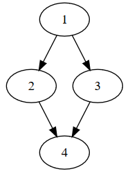

Dominator Analysis
==================

What are dominators?
--------------------
Suppose we have two nodes A and B, residing in a control flow graph (CFG). We say that node A dominates node B if and only if for executing node B, the program has to go through node A. A node always dominates itself.

In the example below, node 1 dominates all nodes in the graph. However, node 2 does not dominate node 4, since there exists another execution path to node 4 that does not include node 2 (namely 1 -> 3 -> 4).



Dominator analysis give structure to CFGs, and can be very useful in static analysis to detect various constructs in a CFG such as loops, and reveal the importance of various nodes in terms of control flow.

Dominator analysis in Echo
--------------------------
To perform dominator analysis on a CFG produced by Echo, we can construct a dominator tree by the following:

```csharp
using Echo.ControlFlow.Analysis.Domination;
...
var dominatorTree = DominatorTree.FromGraph(graph);
```

A `DominatorTree` has a `Root` node, and every node in the tree corresponds to one node in the original control flow graph. Furthermore, a dominator tree can be used to verify whether a specific node dominates another. Taking the example in the figure above, we have that:

```csharp
dominatorTree.Dominates(n1, n4) // returns true
dominatorTree.Dominates(n2, n4) // returns false
```